# JavaScript

# Fundamentals

```
Concepts, Examples, and Validations
```

## Javascript Intro

► JavaScript is a versatile scripting language used
primarily for creating dynamic and interactive web
content. It runs on the client side and can manipulate
HTML and CSS, validate form inputs, and handle events.

► Example:

► **<script> alert('Hello, JavaScript!');</script>**


## Variables

► Variables store data that can be used and manipulated
throughout the program. Declared using var, let, or
const.

► Example:

► let name = "John";

► const age = 25;

► var isStudent = true;


## Datatypes

Common data types include:

String , Number , Boolean , Undefined , Null ,Object ,Array

► Example:

► **let str = "Hello";**

► **let num = 10;**

► **let bool = true;**

► **let undf;**

► **let nul = null;**

► **let obj = { name: "Alice" };**

► **let arr = [1, 2, 3];**


## Operators

► Operators are used to perform operations on variables
and values.

► Includes arithmetic, comparison, logical, assignment,
and more.

► Example:

► let x = 5 + 2; // Arithmetic

► let y = x > 3; // Comparison

► let z = true && false; // Logical

► x += 1; // Assignment


## Conditional Statements

► Conditional statements let you make decisions in your
code — you execute different blocks of code depending
on whether a condition is true or false.

► Control flow based on conditions using if, else if, else ,
switch and ternary condition


## If Condition Statement

► Executes a block of code only if the condition is true.

► Example:

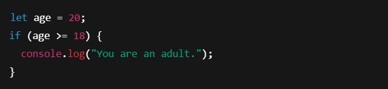 *(placeholder image)*

► Output:

```
You are an adult.
```

## If...else Condition Statement

► Executes one block if the condition is true, and another
if it's false.

► Example:

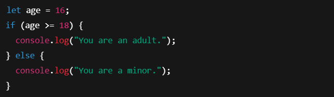 *(placeholder image)*

► Output:

```
You are a minor.
```

## If...else if...else Statement

► Checks multiple conditions in order.

► Example:

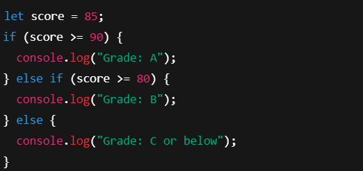 *(placeholder image)*

► Output:

```
Grade: B
```

## Switch Statement

► Used to perform different actions based on **multiple
possible values** of a variable.

► Example:

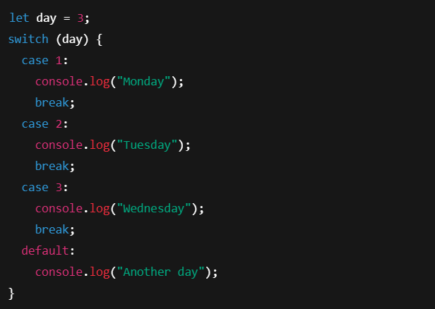 *(placeholder image)*

► Output : **Wednesday**


## Ternary Statement

► A shortcut for simple if...else. Returns one of two
values based on a condition.

► Example:

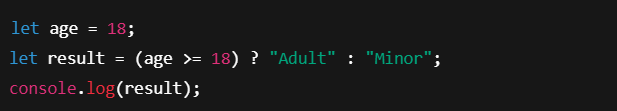 *(placeholder image)*

► Output:

```
Adult
```

## Looping Structure

► **Looping conditions** allow you to repeatedly execute a
block of code as long as a specified condition is true.

► Example:

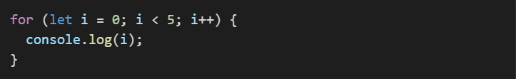 *(placeholder image)*


## For Loop

Executes a block of code a known number of times. It
includes three parts:

- **Initialization** – runs once at the beginning.
- **Condition** – checked before every iteration.
- **Increment/Decrement** – updates the loop counter after
    each iteration.

► Example:

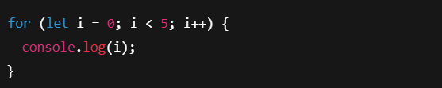 *(placeholder image)*

► Output : 0 1 2 3 4


## While Loop

► Executes a block of code as long as the condition is
true. The condition is evaluated before the loop body.

► Example:

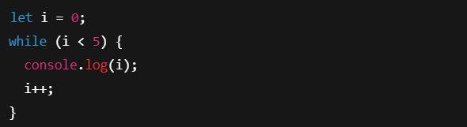 *(placeholder image)*

► Output : 0 1 2 3 4


## Do...While Loop

► Similar to while, but the loop executes at least once,
because the condition is checked after the loop body.

► Example:

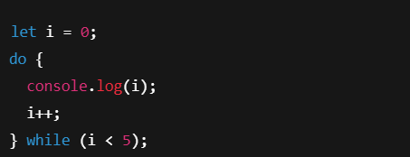 *(placeholder image)*

► Output : 0 1 2 3 4


## For...In Loop

► Used to iterate over **keys (property names)** of an
object

► Example:

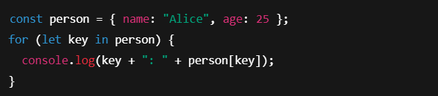 *(placeholder image)*

► Output :

```
name: Alice
age: 25
```

## For...of Loop

► Used to iterate over **iterable values** like arrays, strings,
maps, etc.

► Example:

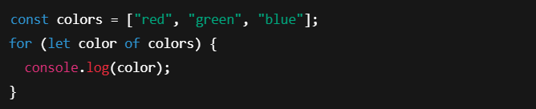 *(placeholder image)*

► Output :

```
red
green
blue
```

## Loop Control Statements

► **Loop control statements** are used to alter the flow of
loops — they let you **skip** , **exit** , or **redirect** iterations in
a loop.

► There are **two main loop control statements** in
JavaScript:
► Break
► Continue


## Break Statement

► Immediately **exits** the loop.

► Useful when you want to stop the loop early based on a
condition.

► Example:

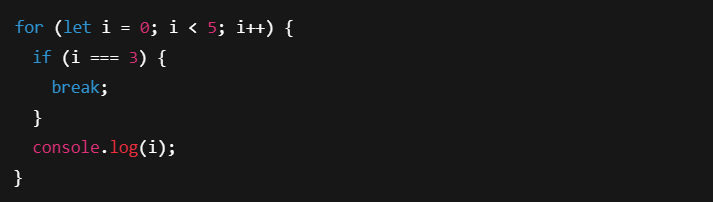 *(placeholder image)*

► Output : 0 1 2


## Continue Statement

► **Skips** the current iteration and moves to the next one.

► Loop does **not stop** , just skips that cycle

► Example:

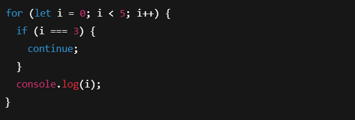 *(placeholder image)*

► Output : 0 1 2 4


## Array

► An **array** is a special variable in JavaScript that can
store **multiple values** in a single variable.

► Example:

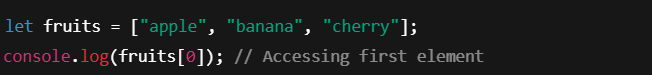 *(placeholder image)*

► Output : apple


## Common Array Methods

► push

► pop

► shift

► unshift

► indexof

► foreach

► map

► filter

► find

► join

► reverse


## push() Method

► Adds an element to the end of the array.

► Example:

 *(placeholder image)*

► Output: ["apple", "banana", "cherry"]


## pop() Method

► Removes the last element from the array.

► Example:

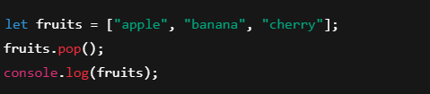 *(placeholder image)*

► Output: ["apple", "banana"]


## shift() Method

```
► Removes the first element from the array.
```
```
► Example:
```
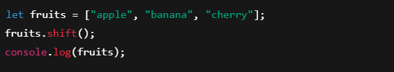 *(placeholder image)*

```
► Output: ["banana", "cherry"]
```

## unshift() Method

```
► Adds an element to the start of the array.
```
```
► Example:
```
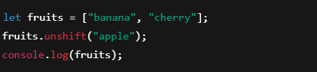 *(placeholder image)*

```
► Output: ["apple", "banana", "cherry"]
```

## indexof() Method

► Returns the index of the specified element. Returns - 1
if not found.

► Example:

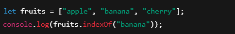 *(placeholder image)*

► Output: 1


## foreach() Method

► Executes a function for each item in the array.

► Example:

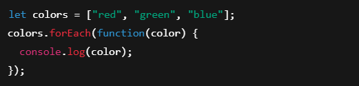 *(placeholder image)*

► Output:

```
red
green
blue
```

## map() Method

► Creates a new array by applying a function to each
item.

► Example:

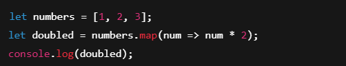 *(placeholder image)*

► Output: [2, 4, 6]


## filter() Method

► Returns a new array with elements that match a
condition.

► Example:

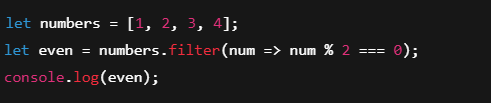 *(placeholder image)*

► Output: [2, 4]


## find() Method

► Returns the first element that satisfies a condition.

► Example:

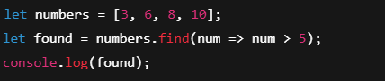 *(placeholder image)*

► Output: 6


## join() Method

► Combines all elements into a string.

► Example:

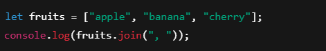 *(placeholder image)*

► Output: apple, banana, cherry


## reverse() Method

► Reverses the array in-place.

► Example:

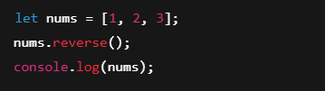 *(placeholder image)*

► Output: [3, 2, 1]


## String

► Strings are used for storing text.

► A string is a sequence of characters used to represent
text.

► Example:

► let greeting = 'Hello';


## String Methods

► Common methods **include length, toUpperCase(),
indexOf()** , etc.

► Example:

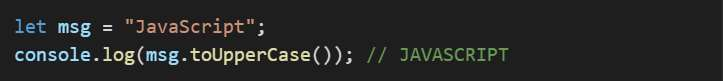 *(placeholder image)*


## 🔤 Common String Methods

| **Method**       | **Purpose**                          |
|------------------|--------------------------------------|
| `length`         | Get string length                    |
| `toLowerCase()`  | Convert to lowercase                 |
| `toUpperCase()`  | Convert to uppercase                 |
| `charAt()`       | Get character at specific index      |
| `indexOf()`      | Get position of substring            |
| `includes()`     | Check if substring exists            |
| `replace()`      | Replace part of string               |
| `slice()`        | Extract a part using index           |
| `substring()`    | Similar to `slice()` (no negatives)  |
| `split()`        | Convert string to array              |
| `trim()`         | Remove spaces from both ends         |


## length

► Returns the number of characters in the string.

► Example:

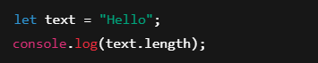 *(placeholder image)*

► Output: 5


## toUpperCase() / toLowerCase()

► Converts string to upper or lower case.

► Example:

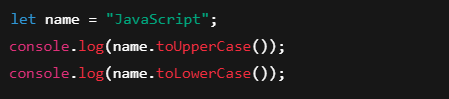 *(placeholder image)*

► Output:

```
JAVASCRIPT
javascript
```

## charAt(index)

► Returns the character at a specific index (starting from
0).

► Example:

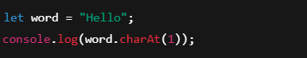 *(placeholder image)*

► Output: e


## indexOf(substring)

► Returns the position of the first occurrence of a
substring.

► Example:

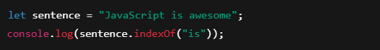 *(placeholder image)*

► Output: 11


## includes(substring)

► Checks if a substring exists → returns true or false.

► Example:

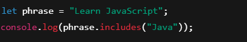 *(placeholder image)*

► Output: true


## replace(old, new)

► Checks if a substring exists → returns true or false.

► Example:

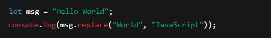 *(placeholder image)*

► Output:

```
Hello JavaScript
```

## slice(start, end)

► Extracts a section of a string.

► Example:

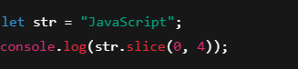 *(placeholder image)*

► Output:

```
Java
```

## substring(start, end)

► Similar to slice() but can't accept negative values.

► Example:

 *(placeholder image)*

► Output:

```
gram
```

## split(separator)

► Splits a string into an array based on a separator.

► Example:

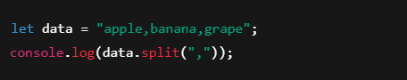 *(placeholder image)*

► Output:

```
["apple", "banana", "grape"]
```

## trim()

► Removes whitespace from both ends.

► Example:

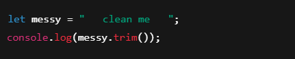 *(placeholder image)*

► Output:

```
"clean me"
```

## Template Strings

► Allows you to embed variables using backticks ` and ${}
syntax.

► Example:

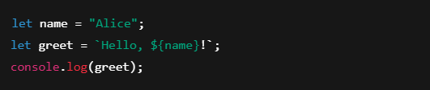 *(placeholder image)*

► Output:

```
Hello, Alice!
```

## Object Intro

► Objects are collections of key-value pairs.

► Example:

► let person = {name: 'John', age: 30};


## Object Properties

► Used to access values in an object.

► Example:

► let person = {name: 'John', age: 30};
person.name; // John


## Object Method

► Functions stored as object properties.

► Example:

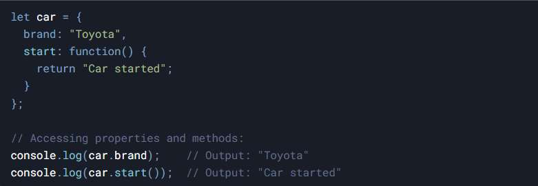 *(placeholder image)*


## Object Display

► Objects can be displayed using console.log or
JSON.stringify.

► Example:


## Object Accessors

► Get and set properties using accessors.

► Example:

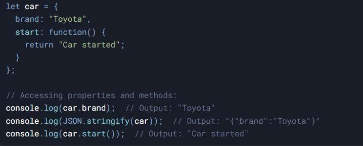 *(placeholder image)*


## Object Sets

► Collections of unique values.

► Example:

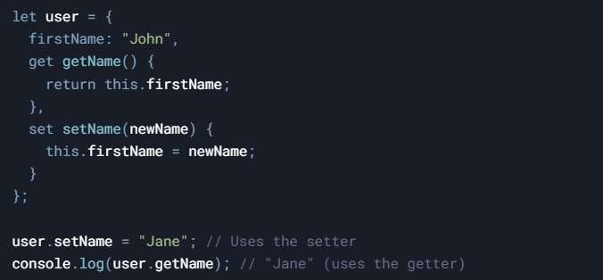 *(placeholder image)*


## Object Maps

► Maps are key-value collections like objects.

► Example:

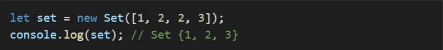 *(placeholder image)*


## Function Intro

► A function is a reusable block of code that performs a
specific task.

► You can define a function once and call it multiple
times with different inputs (parameters).


## Types of Functions

► Named (Function Declaration) , anonymous, arrow
functions, Constructor Function , etc.

► Example:

► const add = (a, b) => a + b; // Arrow Functions


### Function Declaration (Named Function)

► A function defined using the function keyword.

► Example:

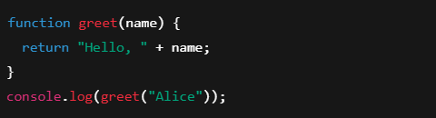 *(placeholder imag

► Output: Hello, Alice


### Function Expression

► A function assigned to a variable. Can be anonymous or
named.

► Example:

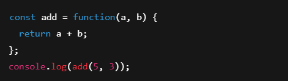 *(placeholder image)*

► Output: 8


### Arrow Expression

► A shorter syntax for writing functions using =>.

► Example:

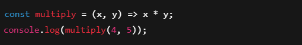 *(placeholder image)*

► Output: 20


### Constructor Function

► Used to create objects. Naming usually starts with a
capital letter.

► Example:

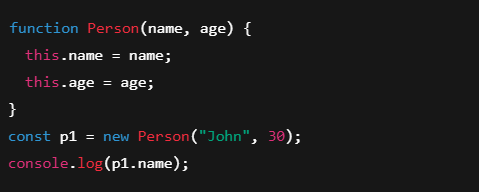 *(placeholder image)*

► Output: John


## Function Parameter

► Input values passed to functions.

► Example:

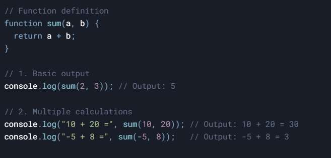 *(placeholder image)*


## Function Invocation

► Calling the function to execute.

► Example:

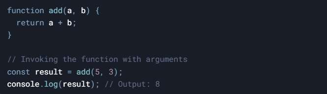 *(placeholder image)*


## Function Call

► Can be called using .call() method.

► Example:

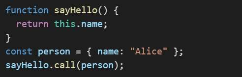 *(placeholder image)*


## Function Bind

► Creates a new function with 'this' bound to the provided
value.

► Example:

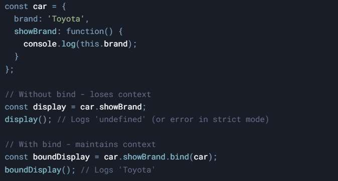 *(placeholder image)*


## Event Handling

► Used to handle events like click, submit, etc.

► Example:

► element.addEventListener('click', myFunction);


## OnClick Event

► Triggers when an element is clicked.

► Example:

► <button onclick='myFunction()'>Click</button>

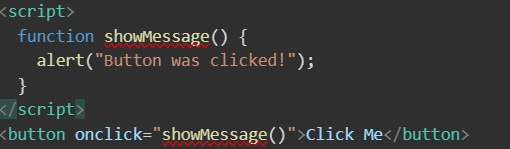 *(placeholder image)*

## mouseover / mouseout Events

```
► mouseover: triggers when mouse enters an element.
► mouseout: triggers when mouse leaves the element.
```
```
► Example:

```

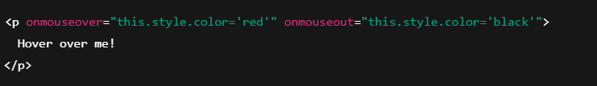 *(placeholder image)*

```
► Output:
Text turns red when hovered.
Turns black again when the mouse leaves.
```

## keydown / keyup Events

► keydown: triggers when a key is pressed.

► keyup: triggers when a key is released.

► Example:

 *(placeholder image)*

► Output: In the console

```
Key down
Key up
```

## focus / blur Events

► focus: when input element gets focus.

► blur: when it loses focus.

► Example:

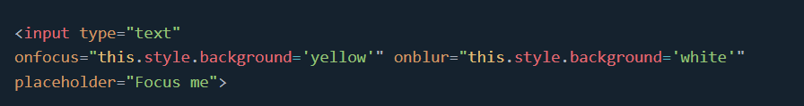 *(placeholder image)*

► Output:

```
Background turns yellow when focused.
Returns to white when you click elsewhere.
```

## dblclick Event

► Triggered when the user double-clicks an element.

► Example:

 *(placeholder image)*

► Output: Text changes to:

```
You double-clicked me!
```

## load Event

► Fires when the page or an image finishes loading.

► Example:

 *(placeholder image)*

► Output: Text changes to:

```
Page has fully loaded!
```

## addEventListener()

► The addEventListener() method attaches an event handler to a
document.

► Example:

 *(placeholder image)*

► Output: When button is clicked:

```
Hi there!
```

## change Event

► Fires when the value of an input/select changes.

► Example:

 *(placeholder image)*

► Output: If you choose "CSS", it alerts:

```
You selected: CSS
```

## OnSubmit Event

► Triggers when a form is submitted.

► Example:

 *(placeholder image)*


## HTML DOM Documents

► The Document Object

► DOM -Document Object Model

► When an HTML document is loaded into a web browser, it

```
becomes a document object.
```
► The document object is the root node of the HTML document.

► The document object is a property of the window object.

► The document object is accessed with:

► window.document or just document


## Why is DOM Important?

► Because it lets you dynamically control your webpage using

```
JavaScript.
```
► For example:

► Change text

► Add new elements

► Remove or hide content

► React to user actions (clicks, typing, etc.)


## 📚 Common DOM Methods

| **Purpose**             | **Method**                 |
|-------------------------|----------------------------|
| By ID                   | `getElementById()`         |
| By Class                | `getElementsByClassName()` |
| By Tag                  | `getElementsByTagName()`   |
| CSS Selector (single)   | `querySelector()`          |
| CSS Selector (all)      | `querySelectorAll()`       |


## getElementById()

► The getElementById() method returns an element with
a specified value.

► The getElementById() method returns null if the
element does not exist.

*(placeholder image)*


## getElementsByClassName()

► The getElementsByClassName() method returns a
collection of elements with a specified class name(s).

*(placeholder image)*


## getElementsByTagName()

► The getElementsByTagName() method returns a collection of
all elements with a specified tag name.

► The getElementsByTagName() method returns an
HTMLCollection.

► The getElementsByTagName() property is read-only.

*(placeholder image)*


## querySelector()

► The querySelector() method returns the first element that
matches a CSS selector.

► To return all matches (not only the first), use the
querySelectorAll() instead.

*(placeholder image)*


## querySelectorAll()

► The querySelectorAll() method returns all elements that
matches a CSS selector(s).

*(placeholder image)*


## JS Validation Intro

► Used to ensure input is correct before submission.

► Example:

► if(input == '') alert('Required field');


## Null constraint Validation

► Check if input is null or empty.

► Example:

*(placeholder image)*


## Password Validation

► Ensure password meets requirements.

► Example:

► if(pwd.length < 8) alert('Too short');

*(placeholder image)*


## Retype Password Validation

► Ensure retyped password matches.

► Example:

*(placeholder image)*


## Number Validation

► Checks if input is a number.

► Example:

*(placeholder image)*


## Email validation

► Validate email format using regex.

► Example:

*(placeholder image)*


