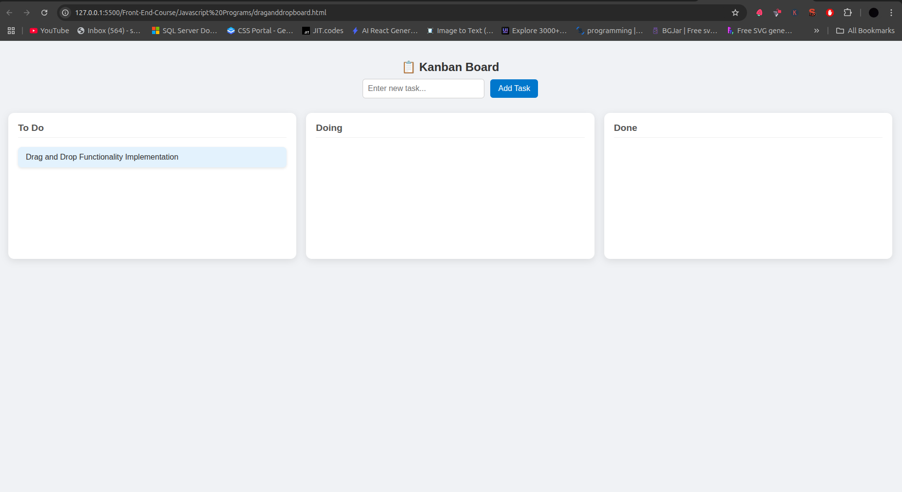
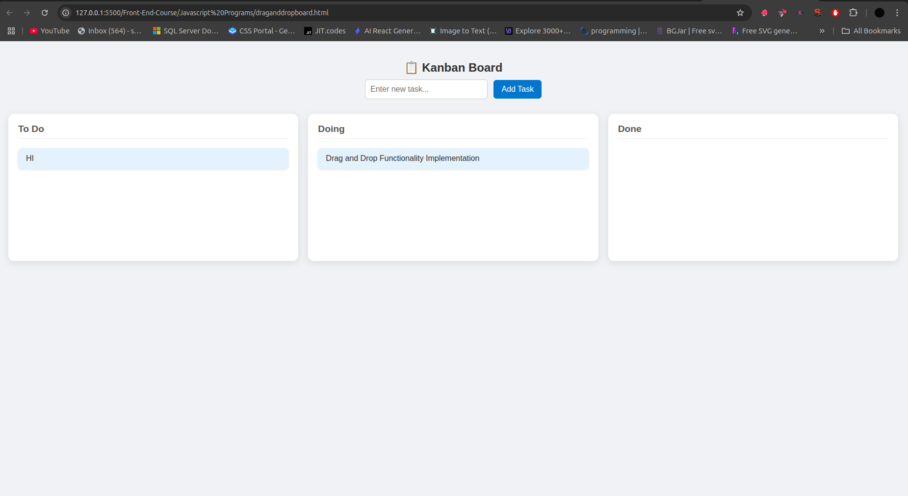
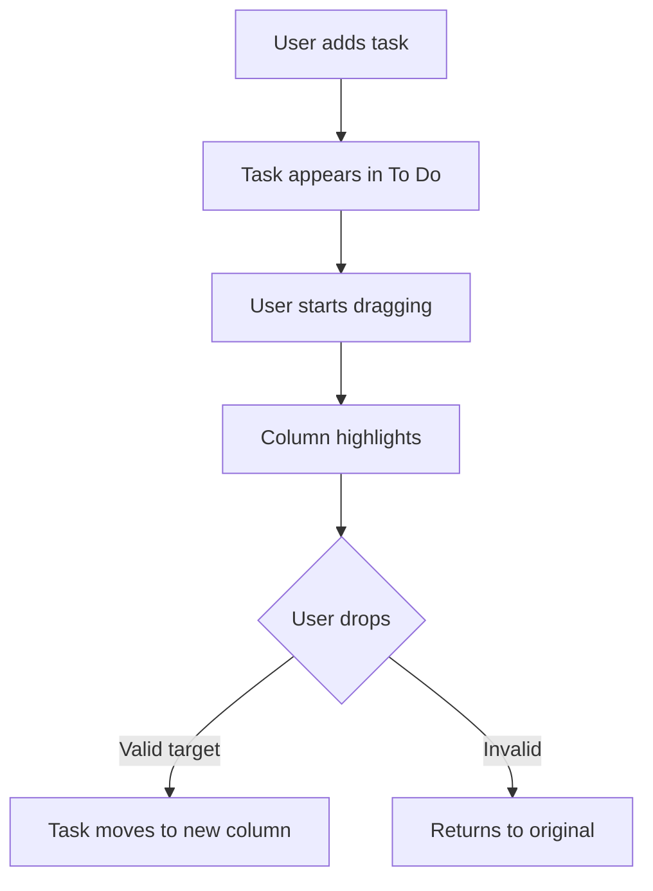

# 📋 Kanban Board - Code Walkthrough

A drag-and-drop task management system with three columns (To Do, Doing, Done).

## Preview
 *(Default state)*  
 *(Adding a task)*  
 *(Dragging a task)*
 *(Dragging a task)*

## Features
- Add tasks to "To Do" column
- Drag tasks between columns
- Visual feedback during drag operations
- Mobile-responsive design
- Clean modern UI with smooth animations

## Complete Code (`kanban.html`)
```html
<!DOCTYPE html>
<html lang="en">
<head>
  <!-- Metadata and CSS -->
</head>
<body>
  <!-- UI Elements -->
  <script>
    // JavaScript functionality
  </script>
</body>
</html>
```

## How It Works - Step by Step

### 1. HTML Structure
```html
<div class="task-creator">
  <input type="text" id="taskInput" placeholder="Enter new task...">
  <button id="addTaskBtn">Add Task</button>
</div>

<div class="board">
    <div class="column" id="todo" 
       ondrop="drop(event)" ondragover="allowDrop(event)"
       ondragenter="highlight(event)" ondragleave="unhighlight(event)">
        <h3>To Do</h3>
    </div>
    <div class="column" ondrop="drop(event)" 
        ondragover="allowDrop(event)" ondragenter="highlight(event)" 
        ondragleave="unhighlight(event)">
      <h3>Doing</h3>
    </div>
    <div class="column" ondrop="drop(event)" 
        ondragover="allowDrop(event)" ondragenter="highlight(event)" 
        ondragleave="unhighlight(event)">
      <h3>Done</h3>
    </div>
</div>
```
- **Task Creator**: Input field + button for new tasks
- **Board Container**: Flexbox layout holding all columns
- **Columns**: Three droppable zones with event handlers

### 2. CSS Styling
Key visual features:
```css
/* Flexbox board layout */
.board {
  display: flex;
  gap: 20px; /* Space between columns */
}

/* Column styling */
.column {
  background: #fff;
  border-radius: 12px;
  box-shadow: 0 4px 15px rgba(0,0,0,0.1);
}

/* Task cards */
.task {
  background: #e3f2fd; /* Light blue */
  cursor: grab;
  transition: transform 0.2s;
}
.task:active {
  cursor: grabbing;
  transform: scale(1.02); /* Grow slightly when grabbed */
}

/* Drag highlight state */
.column.drag-over {
  background-color: #f1f8ff; /* Lighter blue */
}
```

### 3. JavaScript Logic

#### Task Creation
```javascript
let taskIdCounter = 0;

document.getElementById('addTaskBtn').addEventListener('click', () => {
  const input = document.getElementById('taskInput');
  const taskText = input.value.trim();
  
  if (!taskText) return alert("Please enter a task.");

  const task = document.createElement('div');
  task.className = 'task';
  task.textContent = taskText;
  task.draggable = true;
  task.id = `task-${taskIdCounter++}`;
  task.ondragstart = drag;

  document.getElementById('todo').appendChild(task);
  input.value = ''; // Clear input
});
```

#### Drag and Drop System
```javascript
// Allow dropping
function allowDrop(ev) {
  ev.preventDefault();
}

// Start dragging
function drag(ev) {
  ev.dataTransfer.setData('text', ev.target.id);
}

// Handle drop
function drop(ev) {
  ev.preventDefault();
  const taskId = ev.dataTransfer.getData('text');
  const task = document.getElementById(taskId);
  
  // Find nearest column parent
  let target = ev.target;
  while (!target.classList.contains('column') && target !== document.body) {
    target = target.parentNode;
  }

  if (target.classList.contains('column')) {
    target.appendChild(task);
    target.classList.remove('drag-over');
  }
}

// Visual feedback
function highlight(ev) {
  // Similar parent finding as drop()
  target.classList.add('drag-over');
}

function unhighlight(ev) {
  // Similar parent finding as drop()
  target.classList.remove('drag-over');
}
```

## Key Algorithms Explained

### DOM Traversal During Drag
```javascript
while (!target.classList.contains('column') && target !== document.body) {
  target = target.parentNode;
}
```
- Ensures we find the actual column even when hovering over child elements
- Prevents errors by checking for document.body exit condition

### Drag Data Transfer
```javascript
ev.dataTransfer.setData('text', ev.target.id);
```
- Stores the dragged task's ID in the drag event
- Allows identifying which task is being moved during drop

## Visual Workflow


## Limitations
- ❌ No data persistence (refresh clears all tasks)
- ❌ No task editing/deletion
- ❌ Basic mobile support (needs touch event handlers)

## Suggested Enhancements
```javascript
// 1. Add localStorage persistence
function saveTasks() {
  const tasks = [];
  document.querySelectorAll('.task').forEach(task => {
    tasks.push({
      id: task.id,
      text: task.textContent,
      column: task.parentElement.id
    });
  });
  localStorage.setItem('kanbanTasks', JSON.stringify(tasks));
}

// 2. Add task deletion
task.addEventListener('dblclick', function() {
  if(confirm('Delete this task?')) this.remove();
});
```

---

**Implementation Notes**:
1. Save as `kanban.html`
2. Open in any modern browser
3. No dependencies required