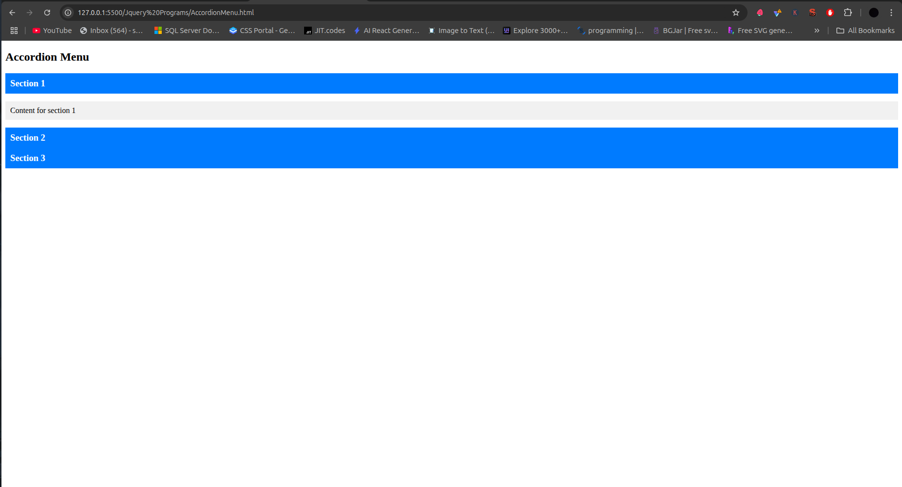

# jQuery Accordion Component



A lightweight, interactive accordion menu built with jQuery that allows users to expand and collapse content sections.

## Table of Contents
- [HTML Structure](#html-structure)
- [CSS Styling](#css-styling)
- [jQuery Script](#jquery-script)
- [How It Works](#how-it-works)
- [Customization Options](#customization-options)
- [Browser Support](#browser-support)
- [Complete Code](#complete-code)

## HTML Structure

```html
<div class="accordion">
  <h3>Section 1</h3>
  <p>Content for section 1</p>
  <h3>Section 2</h3>
  <p>Content for section 2</p>
  <h3>Section 3</h3>
  <p>Content for section 3</p>
</div>
```

- Uses semantic HTML5 structure
- Each section consists of:
  - Clickable header (`<h3>`)
  - Content panel (`<p>`)
- Wrapped in a container with class `accordion`

## CSS Styling

```css
.accordion h3 {
  cursor: pointer;        /* Shows hand cursor on hover */
  background: #007BFF;    /* Blue background */
  color: white;           /* White text */
  margin: 0;              /* Remove default margin */
  padding: 10px;          /* Add padding */
}

.accordion p {
  display: none;          /* Hide content by default */
  padding: 10px;          /* Add padding */
  background: #f1f1f1;    /* Light gray background */
}
```

## jQuery Script

```javascript
$('.accordion h3').click(function () {
  // Toggle next content panel
  $(this).next('p').slideToggle();
  
  // Close other open panels
  $('.accordion p').not($(this).next()).slideUp();
});
```

### Script Breakdown

1. **Element Selection**:
   ```javascript
   $('.accordion h3')
   ```
   - Selects all `<h3>` elements within `.accordion`

2. **Click Event Handler**:
   ```javascript
   .click(function () { ... })
   ```
   - Attaches a click event to each header

3. **Toggle Current Panel**:
   ```javascript
   $(this).next('p').slideToggle();
   ```
   - `$(this)` refers to clicked header
   - `.next('p')` finds the immediate next `<p>` element
   - `.slideToggle()` animates show/hide with sliding motion

4. **Close Other Panels**:
   ```javascript
   $('.accordion p').not($(this).next()).slideUp();
   ```
   - Selects all panels except current
   - `.slideUp()` closes them with animation

## How It Works

1. **Initial State**:
   - All content panels are hidden (`display: none`)
   - Headers are visible with styling

2. **User Interaction**:
   - Clicking a header:
     1. Expands its associated content panel
     2. Collapses any other open panels
     3. Uses smooth sliding animations

3. **Animation Flow**:
   ```mermaid
   sequenceDiagram
     User->>Header: Clicks
     Header->>jQuery: Triggers click handler
     jQuery->>Current Panel: slideToggle()
     jQuery->>Other Panels: slideUp()
   ```

## Customization Options

### Change Animation Speed
```javascript
.slideToggle(500) // 500ms animation
.slideUp(300)     // 300ms animation
```

### Allow Multiple Open Panels
```javascript
// Remove the slideUp() line
$(this).next('p').slideToggle();
```

### Add Icons
```css
.accordion h3::after {
  content: '+';
  float: right;
}
.accordion h3.active::after {
  content: '-';
}
```

## Browser Support
| Browser | Version |
|---------|---------|
| Chrome  | All     |
| Firefox | All     |
| Safari  | 3.2+    |
| Edge    | All     |
| IE      | 9+      |

## Complete Code

```html
<!DOCTYPE html>
<html lang="en">
<head>
  <meta charset="UTF-8">
  <title>jQuery Accordion</title>
  <script src="https://code.jquery.com/jquery-3.6.0.min.js"></script>
  <style>
    .accordion h3 {
      cursor: pointer;
      background: #007BFF;
      color: white;
      margin: 0;
      padding: 10px;
    }
    .accordion p {
      display: none;
      padding: 10px;
      background: #f1f1f1;
    }
  </style>
</head>
<body>
  <h2>Accordion Menu</h2>
  <div class="accordion">
    <h3>Section 1</h3>
    <p>Content for section 1</p>
    <h3>Section 2</h3>
    <p>Content for section 2</p>
    <h3>Section 3</h3>
    <p>Content for section 3</p>
  </div>

  <script>
    $('.accordion h3').click(function () {
      $(this).next('p').slideToggle();
      $('.accordion p').not($(this).next()).slideUp();
    });
  </script>
</body>
</html>
```

## Dependencies
- jQuery 3.6.0+ (loaded from CDN)
