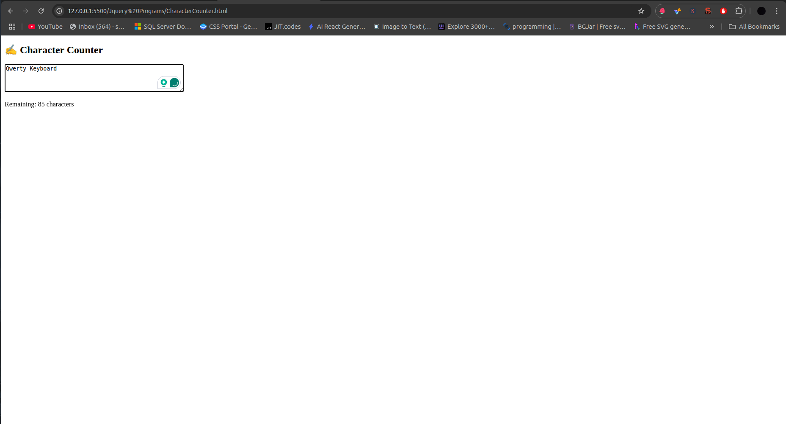

# ✍️ Character Counter



A lightweight character counter that shows remaining characters in real-time as users type in a textarea.

## Table of Contents
- [HTML Structure](#html-structure)
- [jQuery Script](#jquery-script)
- [How It Works](#how-it-works)
- [Customization Options](#customization-options)
- [Browser Support](#browser-support)
- [Complete Code](#complete-code)

## HTML Structure

```html
<textarea id="text" maxlength="100" rows="4" cols="50" placeholder="Type something..."></textarea>
<p>Remaining: <span id="count">100</span> characters</p>
```

- **Textarea**:
  - `id="text"` for jQuery selection
  - `maxlength="100"` sets character limit
  - `rows` and `cols` define default size
  - `placeholder` shows hint text

- **Counter Display**:
  - Shows remaining characters
  - `span#count` updates dynamically

## jQuery Script

```javascript
$('#text').keyup(function () {
  const max = 100;
  const length = $(this).val().length;
  $('#count').text(max - length);
});
```

### Script Breakdown

1. **Element Selection**:
   ```javascript
   $('#text')
   ```
   - Selects the textarea by ID

2. **Keyup Event Handler**:
   ```javascript
   .keyup(function () { ... })
   ```
   - Triggers on every key release
   - More responsive than `change` event

3. **Character Calculation**:
   ```javascript
   const max = 100;
   const length = $(this).val().length;
   ```
   - Gets maximum length (100)
   - Calculates current text length

4. **Update Display**:
   ```javascript
   $('#count').text(max - length);
   ```
   - Updates counter span with remaining characters

## How It Works

1. **Initial State**:
   - Counter shows "100" (max length)
   - Textarea is empty

2. **User Interaction**:
   ```mermaid
   sequenceDiagram
     User->>Textarea: Types character
     Textarea->>jQuery: Fires keyup event
     jQuery->>Counter: Updates remaining count
   ```

3. **Real-time Updates**:
   - Updates after every keystroke
   - Includes backspace/delete keys
   - Matches browser's native maxlength enforcement

## Customization Options

### Change Maximum Length
```javascript
const max = 200; // Change to 200 characters
```

### Add Warning Styles
```css
#count.warning {
  color: orange;
}
#count.danger {
  color: red;
}
```

```javascript
// Add to keyup handler:
if (remaining < 10) {
  $('#count').addClass('danger').removeClass('warning');
} else if (remaining < 30) {
  $('#count').addClass('warning').removeClass('danger');
} else {
  $('#count').removeClass('warning danger');
}
```

### Count Down Instead of Up
```javascript
$('#count').text(length); // Shows characters used
```

## Browser Support
| Browser | Version |
|---------|---------|
| Chrome  | All     |
| Firefox | All     |
| Safari  | 3.2+    |
| Edge    | All     |
| IE      | 9+      |

## Complete Code

```html
<!DOCTYPE html>
<html lang="en">
<head>
  <meta charset="UTF-8">
  <title>Character Counter</title>
  <script src="https://code.jquery.com/jquery-3.6.0.min.js"></script>
  <style>
    textarea {
      font-family: Arial, sans-serif;
      padding: 8px;
    }
    #count {
      font-weight: bold;
    }
  </style>
</head>
<body>
  <h2>✍️ Character Counter</h2>
  <textarea id="text" maxlength="100" rows="4" cols="50" placeholder="Type something..."></textarea>
  <p>Remaining: <span id="count">100</span> characters</p>

  <script>
    $('#text').keyup(function () {
      const max = 100;
      const length = $(this).val().length;
      $('#count').text(max - length);
    });
  </script>
</body>
</html>
```

## Dependencies
- jQuery 3.6.0+ (loaded from CDN)
