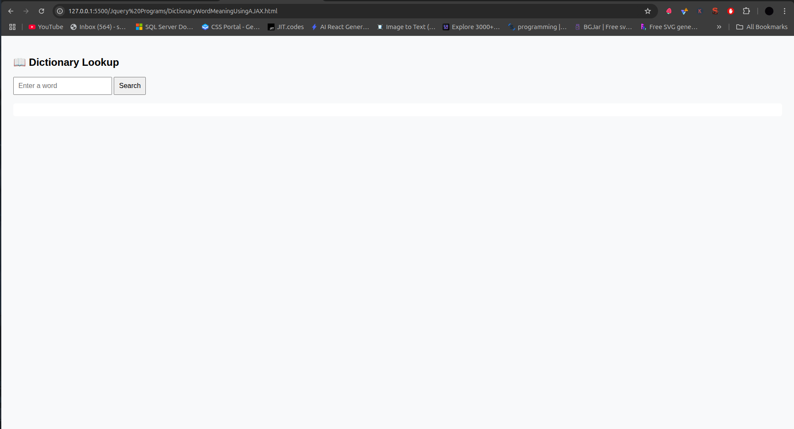
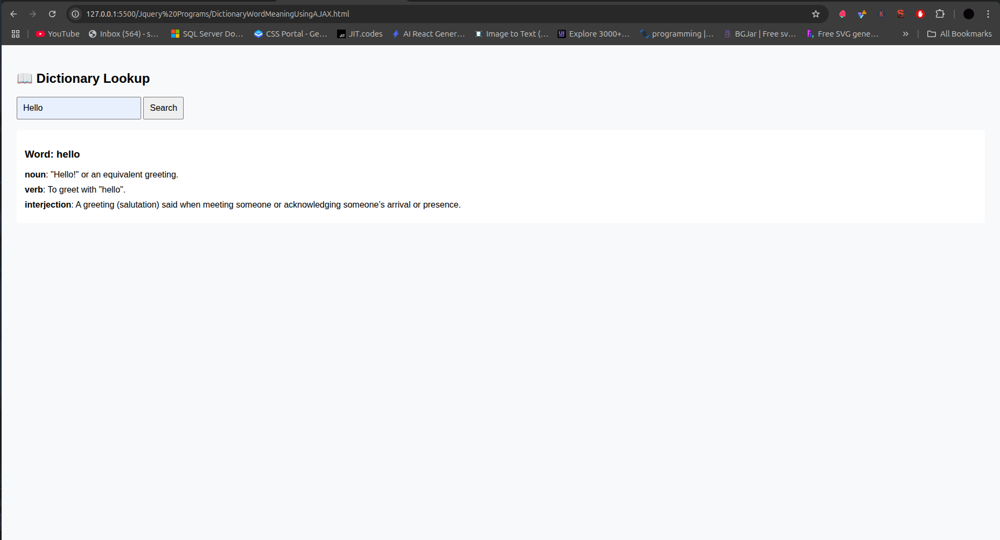

# 📖 Dictionary Lookup with jQuery





A web application that fetches and displays word definitions using the Free Dictionary API.

## Table of Contents
- [HTML Structure](#html-structure)
- [CSS Styling](#css-styling)
- [jQuery Script](#jquery-script)
- [AJAX Request](#ajax-request)
- [How It Works](#how-it-works)
- [Customization](#customization)
- [Browser Support](#browser-support)
- [Complete Code](#complete-code)

## HTML Structure

```html
<input type="text" id="wordInput" placeholder="Enter a word" />
<button id="searchBtn">Search</button>
<div id="result"></div>
```

- **Input Field**:
  - `id="wordInput"` for jQuery selection
  - Placeholder text guides users

- **Search Button**:
  - Triggers the lookup functionality
  - `id="searchBtn"` for event binding

- **Result Container**:
  - Initially empty
  - Dynamically populated with API results

## CSS Styling

```css
body {
  font-family: sans-serif;
  background: #f8f9fa;
  padding: 20px;
}

input, button {
  padding: 10px;
  font-size: 16px;
}

#result {
  margin-top: 20px;
  padding: 15px;
  background: #fff;
  border-radius: 5px;
}

.meaning {
  margin-bottom: 10px;
}
```

## jQuery Script

```javascript
$('#searchBtn').click(function () {
  const word = $('#wordInput').val().trim();
  if (!word) return alert('Please enter a word.');

  $('#result').html('<em>Searching...</em>');

  $.ajax({
    url: `https://api.dictionaryapi.dev/api/v2/entries/en/${word}`,
    method: 'GET',
    success: function (data) {
      // Process successful response
      const meanings = data[0].meanings;
      let output = `<h3>Word: ${data[0].word}</h3>`;
      
      meanings.forEach((meaning, i) => {
        output += `<div class="meaning">
          <strong>${meaning.partOfSpeech}</strong>: 
          ${meaning.definitions[0].definition}
        </div>`;
      });
      
      $('#result').html(output);
    },
    error: function () {
      $('#result').html('<span style="color: red;">No definitions found.</span>');
    }
  });
});
```

## AJAX Request

The application uses jQuery's `$.ajax()` method to fetch data from the [Free Dictionary API](https://dictionaryapi.dev/):

### Request Configuration
```javascript
$.ajax({
  url: `https://api.dictionaryapi.dev/api/v2/entries/en/${word}`,
  method: 'GET',
  success: function (data) { ... },
  error: function () { ... }
});
```

- **URL**: API endpoint with dynamic word parameter
- **Method**: GET request
- **Success Callback**: Processes the API response
- **Error Callback**: Handles failed requests

### Response Handling
The API returns an array of word entries. Each entry contains:
- `word`: The searched term
- `meanings`: Array of definitions with:
  - `partOfSpeech`: (noun, verb, etc.)
  - `definitions`: Array of definitions

## How It Works

1. **User Flow**:
   ```mermaid
   sequenceDiagram
     User->>Input: Enters word
     User->>Button: Clicks Search
     Button->>jQuery: Triggers click handler
     jQuery->>API: Sends AJAX request
     API->>jQuery: Returns response
     jQuery->>DOM: Updates #result
   ```

2. **Error Handling**:
   - Empty input validation
   - API error responses
   - Network failure cases

3. **Performance**:
   - Shows loading state during request
   - Minimal DOM updates

## Customization

### Add Pronunciation
```javascript
output += `<p>Pronunciation: ${data[0].phonetic || 'N/A'}</p>`;
```

### Show Multiple Definitions
```javascript
meaning.definitions.slice(0, 3).forEach(def => {
  output += `<div>• ${def.definition}</div>`;
});
```

### Add Example Sentences
```javascript
if (def.example) {
  output += `<div class="example">"${def.example}"</div>`;
}
```

## Browser Support
| Browser | Version |
|---------|---------|
| Chrome  | All     |
| Firefox | All     |
| Safari  | 5.1+    |
| Edge    | All     |
| IE      | 10+     |

## Complete Code

```html
<!DOCTYPE html>
<html lang="en">
<head>
  <meta charset="UTF-8">
  <title>Dictionary Lookup</title>
  <script src="https://code.jquery.com/jquery-3.6.0.min.js"></script>
  <style>
    body { font-family: sans-serif; padding: 20px; background: #f8f9fa; }
    input, button { padding: 10px; font-size: 16px; }
    #result { margin-top: 20px; padding: 15px; background: #fff; border-radius: 5px; }
    .meaning { margin-bottom: 10px; }
    .example { color: #666; font-style: italic; margin-left: 10px; }
  </style>
</head>
<body>
  <h2>📖 Dictionary Lookup</h2>
  <input type="text" id="wordInput" placeholder="Enter a word" />
  <button id="searchBtn">Search</button>
  <div id="result"></div>

  <script>
    $('#searchBtn').click(function () {
      const word = $('#wordInput').val().trim();
      if (!word) return alert('Please enter a word.');

      $('#result').html('<em>Searching...</em>');

      $.ajax({
        url: `https://api.dictionaryapi.dev/api/v2/entries/en/${word}`,
        method: 'GET',
        success: function (data) {
          const meanings = data[0].meanings;
          let output = `<h3>${data[0].word}</h3>`;
          
          meanings.forEach(meaning => {
            output += `<div class="meaning">
              <strong>${meaning.partOfSpeech}</strong>:
              ${meaning.definitions[0].definition}
            </div>`;
          });
          
          $('#result').html(output);
        },
        error: function () {
          $('#result').html('<span style="color: red;">Word not found. Try another.</span>');
        }
      });
    });
  </script>
</body>
</html>
```

## Dependencies
- [jQuery](https://jquery.com/) 3.6.0+
- [Free Dictionary API](https://dictionaryapi.dev/)
