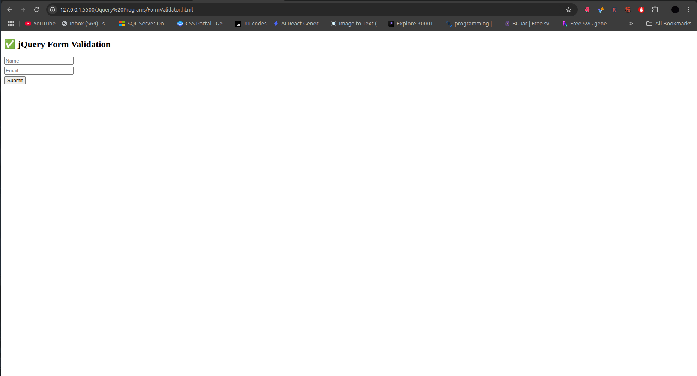

# ✅ jQuery Form Validation




A lightweight form validation system using jQuery that checks for required fields before submission.

## Table of Contents
- [HTML Structure](#html-structure)
- [CSS Styling](#css-styling)
- [jQuery Validation Script](#jquery-validation-script)
- [How It Works](#how-it-works)
- [Validation Logic](#validation-logic)
- [Customization](#customization)
- [Browser Support](#browser-support)
- [Complete Code](#complete-code)

## HTML Structure

```html
<form id="myForm">
  <input type="text" id="name" placeholder="Name" />
  <input type="email" id="email" placeholder="Email" />
  <button type="submit">Submit</button>
</form>
<p id="msg"></p>
```

- **Form Elements**:
  - Text input for name (`#name`)
  - Email input for email (`#email`)
  - Submit button
- **Message Display**:
  - Empty paragraph (`#msg`) for validation messages

## CSS Styling

```css
input {
  margin: 5px 0;  /* Vertical spacing */
  display: block; /* Stack inputs vertically */
}
```

## jQuery Validation Script

```javascript
$('#myForm').submit(function (e) {
  // Prevent default form submission
  e.preventDefault();
  
  // Get field values
  const name = $('#name').val();
  const email = $('#email').val();
  
  // Validation check
  if (name === '' || email === '') {
    // Show error message
    $('#msg').text('All fields are required!').css('color', 'red');
  } else {
    // Show success message
    $('#msg').text('Form submitted successfully!').css('color', 'green');
  }
});
```

### Script Breakdown

1. **Form Submission Handler**:
   ```javascript
   $('#myForm').submit(function (e) { ... });
   ```
   - Listens for form submission events

2. **Prevent Default Action**:
   ```javascript
   e.preventDefault();
   ```
   - Stops the form from submitting traditionally
   - Allows client-side validation first

3. **Field Value Collection**:
   ```javascript
   const name = $('#name').val();
   const email = $('#email').val();
   ```
   - Gets current values from input fields

4. **Validation Logic**:
   ```javascript
   if (name === '' || email === '') { ... } else { ... }
   ```
   - Checks for empty fields
   - Provides visual feedback

## How It Works

1. **User Flow**:
   ```mermaid
   sequenceDiagram
     User->>Form: Fills fields
     User->>Submit Button: Clicks
     Form->>jQuery: Triggers submit handler
     jQuery->>Validation: Checks fields
     Validation->>User: Shows feedback
   ```

2. **Validation Process**:
   - Checks if either field is empty
   - Displays red error message if validation fails
   - Shows green success message if validation passes

3. **Key Features**:
   - Instant feedback
   - Simple required field validation
   - Prevents invalid submissions

## Validation Logic

### Current Validation Rules
1. **Name Field**:
   - Not empty
   - No format checking

2. **Email Field**:
   - Not empty
   - Basic email format (browser-native validation)

### Enhanced Validation Example
```javascript
function isValidEmail(email) {
  return /^[^\s@]+@[^\s@]+\.[^\s@]+$/.test(email);
}

if (name === '') {
  $('#msg').text('Name is required!').css('color', 'red');
} else if (!isValidEmail(email)) {
  $('#msg').text('Please enter a valid email!').css('color', 'red');
} else {
  $('#msg').text('Form submitted successfully!').css('color', 'green');
}
```

## Customization

### Add Field Highlighting
```css
.error { border: 1px solid red; }
```

```javascript
// Add to validation:
$('#name, #email').removeClass('error');
if (name === '') $('#name').addClass('error');
if (email === '') $('#email').addClass('error');
```

### Add Character Minimum
```javascript
if (name.length < 3) {
  $('#msg').text('Name must be at least 3 characters').css('color', 'red');
}
```

### Real-time Validation
```javascript
$('#name, #email').keyup(function() {
  // Validate as user types
});
```

## Browser Support
| Browser | Version |
|---------|---------|
| Chrome  | All     |
| Firefox | All     |
| Safari  | 5.1+    |
| Edge    | All     |
| IE      | 9+      |

## Complete Code

```html
<!DOCTYPE html>
<html lang="en">
<head>
  <meta charset="UTF-8">
  <title>Form Validation</title>
  <script src="https://code.jquery.com/jquery-3.6.0.min.js"></script>
  <style>
    input { 
      margin: 5px 0;
      display: block;
      padding: 8px;
      width: 200px;
    }
    button {
      padding: 8px 16px;
      margin-top: 10px;
    }
    #msg {
      margin-top: 10px;
      font-weight: bold;
    }
  </style>
</head>
<body>
  <h2>✅ jQuery Form Validation</h2>
  <form id="myForm">
    <input type="text" id="name" placeholder="Name" required />
    <input type="email" id="email" placeholder="Email" required />
    <button type="submit">Submit</button>
  </form>
  <p id="msg"></p>

  <script>
    $('#myForm').submit(function (e) {
      e.preventDefault();
      const name = $('#name').val().trim();
      const email = $('#email').val().trim();
      
      if (name === '' || email === '') {
        $('#msg').text('All fields are required!').css('color', 'red');
      } else {
        $('#msg').text('Form submitted successfully!').css('color', 'green');
        // this.submit(); // Uncomment to actually submit
      }
    });
  </script>
</body>
</html>
```

## Dependencies
- [jQuery](https://jquery.com/) 3.6.0+
