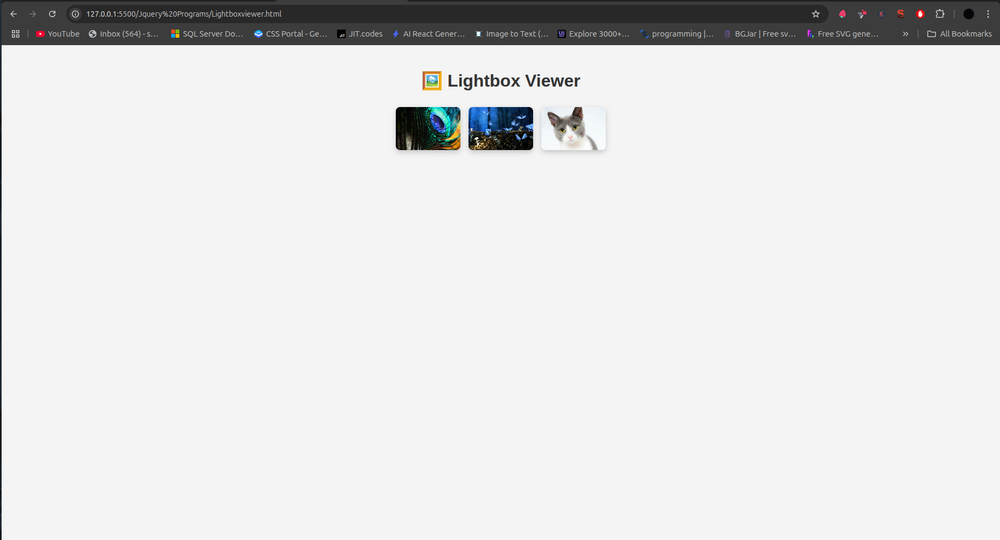
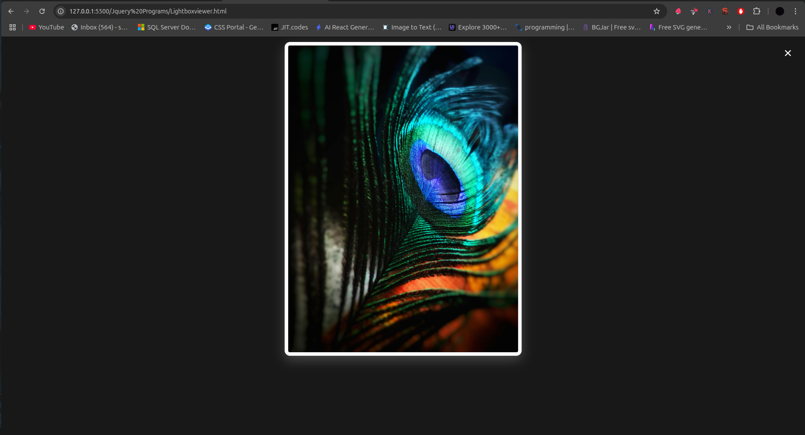

# 🖼️ jQuery Lightbox Viewer




A responsive image lightbox gallery with smooth transitions and elegant styling.

## Table of Contents
- [HTML Structure](#html-structure)
- [CSS Styling](#css-styling)
- [jQuery Functionality](#jquery-functionality)
- [How It Works](#how-it-works)
- [Customization](#customization)
- [Browser Support](#browser-support)
- [Complete Code](#complete-code)

## HTML Structure

```html
<div class="thumbs">
  
  
  
</div>

<div id="lightbox">
  <span id="close-btn">&times;</span>
  
</div>
```

- **Thumbnail Gallery**:
  - Container with class `thumbs`
  - Contains clickable thumbnail images

- **Lightbox Components**:
  - Full-screen overlay container (`#lightbox`)
  - Close button (× symbol)
  - Empty image element (`#light-img`)

## CSS Styling

### Key Features:
```css
.thumbs {
  display: flex;
  justify-content: center;
  flex-wrap: wrap;
  gap: 15px; /* Modern gap property */
}

.thumbs img {
  width: 120px;
  height: 80px;
  object-fit: cover; /* Maintain aspect ratio */
  transition: transform 0.3s, box-shadow 0.3s;
}

#lightbox {
  position: fixed;
  background: rgba(0, 0, 0, 0.9); /* Semi-transparent black */
  display: flex;
  justify-content: center;
  align-items: center;
  z-index: 1000; /* Ensure it's on top */
}

#lightbox img {
  max-width: 90%;
  max-height: 80%;
  border: 8px solid #fff;
}
```

## jQuery Functionality

```javascript
// Open lightbox
$('.thumbs img').click(function () {
  $('#light-img').attr('src', $(this).attr('src'));
  $('#lightbox').fadeIn();
});

// Close lightbox
$('#lightbox, #close-btn').click(function () {
  $('#lightbox').fadeOut();
});

// Prevent image clicks from closing
$('#light-img').click(function (e) {
  e.stopPropagation();
});
```

### Script Breakdown

1. **Thumbnail Click Handler**:
   ```javascript
   $('.thumbs img').click(function () { ... });
   ```
   - Copies clicked image's src to lightbox
   - Fades in the lightbox

2. **Close Lightbox**:
   ```javascript
   $('#lightbox, #close-btn').click(...)
   ```
   - Closes when clicking overlay or close button
   - Uses `fadeOut()` for smooth transition

3. **Event Propagation Control**:
   ```javascript
   e.stopPropagation();
   ```
   - Prevents lightbox from closing when clicking the image

## How It Works

1. **User Flow**:
   ```mermaid
   sequenceDiagram
     User->>Thumbnail: Clicks
     jQuery->>Lightbox: Copies image source
     jQuery->>Lightbox: Fades in overlay
     User->>Close Button: Clicks
     jQuery->>Lightbox: Fades out
   ```

2. **Key Interactions**:
   - Click thumbnails to view larger version
   - Click anywhere to close (except the image itself)
   - Close button in top-right corner

3. **Animation Effects**:
   - Smooth fade in/out transitions
   - Hover effects on thumbnails
   - Image scaling animations

## Customization

### Add Navigation Arrows
```html
<div id="lightbox">
  <span class="nav-btn" id="prev-btn">❮</span>
  <span class="nav-btn" id="next-btn">❯</span>
  <!-- ... -->
</div>
```

```javascript
let currentIndex = 0;
const images = $('.thumbs img');

$('#next-btn').click(() => {
  currentIndex = (currentIndex + 1) % images.length;
  updateLightbox();
});

$('#prev-btn').click(() => {
  currentIndex = (currentIndex - 1 + images.length) % images.length;
  updateLightbox();
});

function updateLightbox() {
  $('#light-img').attr('src', images.eq(currentIndex).attr('src'));
}
```

### Add Captions
```html
<div id="caption"></div>
```

```javascript
$('.thumbs img').click(function() {
  $('#caption').text($(this).attr('alt'));
});
```

### Keyboard Navigation
```javascript
$(document).keydown(function(e) {
  if ($('#lightbox').is(':visible')) {
    if (e.key === 'Escape') $('#lightbox').fadeOut();
    if (e.key === 'ArrowRight') $('#next-btn').click();
    if (e.key === 'ArrowLeft') $('#prev-btn').click();
  }
});
```

## Browser Support
| Browser | Version |
|---------|---------|
| Chrome  | All     |
| Firefox | All     |
| Safari  | 9+      |
| Edge    | All     |
| IE      | 11+     |

## Complete Code

```html
<!DOCTYPE html>
<html lang="en">
<head>
  <meta charset="UTF-8">
  <title>Lightbox Viewer</title>
  <script src="https://code.jquery.com/jquery-3.6.0.min.js"></script>
  <style>
    * { box-sizing: border-box; }
    
    body {
      margin: 0;
      font-family: 'Segoe UI', sans-serif;
      background: #f4f4f4;
      text-align: center;
      padding: 20px;
    }
    
    h2 {
      color: #333;
      font-size: 2rem;
      margin-bottom: 30px;
    }
    
    .thumbs {
      display: flex;
      justify-content: center;
      flex-wrap: wrap;
      gap: 15px;
    }
    
    .thumbs img {
      width: 120px;
      height: 80px;
      object-fit: cover;
      border-radius: 8px;
      box-shadow: 0 4px 10px rgba(0, 0, 0, 0.2);
      transition: transform 0.3s, box-shadow 0.3s;
      cursor: pointer;
    }
    
    .thumbs img:hover {
      transform: scale(1.1);
      box-shadow: 0 8px 20px rgba(0, 0, 0, 0.3);
    }
    
    #lightbox {
      display: none;
      position: fixed;
      top: 0; left: 0;
      width: 100%; height: 100%;
      background: rgba(0, 0, 0, 0.9);
      justify-content: center;
      align-items: center;
      z-index: 1000;
      flex-direction: column;
    }
    
    #lightbox img {
      max-width: 90%;
      max-height: 80%;
      border: 8px solid #fff;
      border-radius: 12px;
      box-shadow: 0 10px 25px rgba(255, 255, 255, 0.2);
    }
    
    #close-btn {
      color: white;
      font-size: 2rem;
      position: absolute;
      top: 20px;
      right: 30px;
      cursor: pointer;
      transition: color 0.3s;
    }
    
    #close-btn:hover {
      color: #ff4d4d;
    }
  </style>
</head>
<body>
  <h2>🖼️ Lightbox Viewer</h2>
  
  <div class="thumbs">
    
    
    
  </div>
  
  <div id="lightbox">
    <span id="close-btn">&times;</span>
    
  </div>
  
  <script>
    $(document).ready(function() {
      // Open lightbox
      $('.thumbs img').click(function() {
        $('#light-img').attr('src', $(this).attr('src'));
        $('#lightbox').fadeIn();
      });
      
      // Close lightbox
      $('#lightbox, #close-btn').click(function() {
        $('#lightbox').fadeOut();
      });
      
      // Prevent image clicks from closing
      $('#light-img').click(function(e) {
        e.stopPropagation();
      });
    });
  </script>
</body>
</html>
```

## Dependencies
- [jQuery](https://jquery.com/) 3.6.0+
