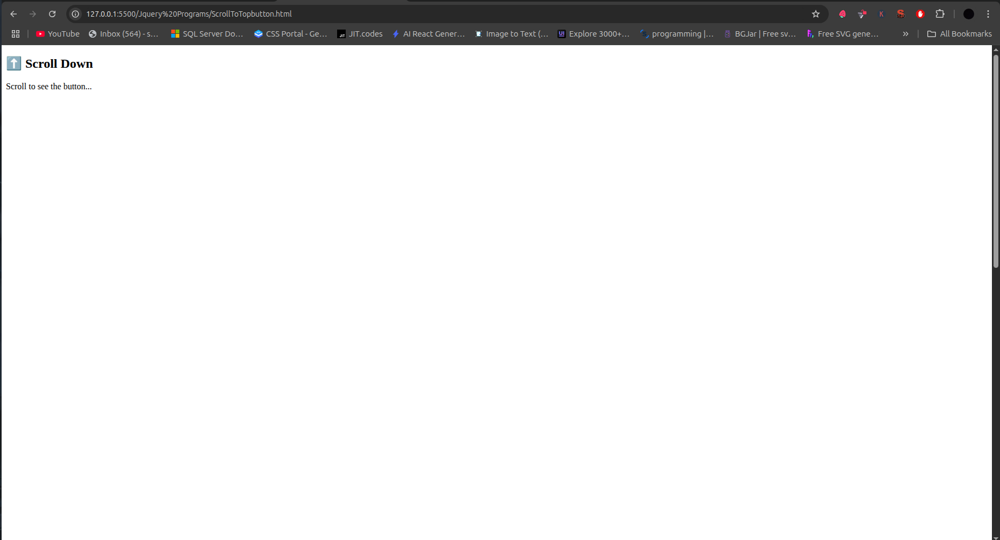
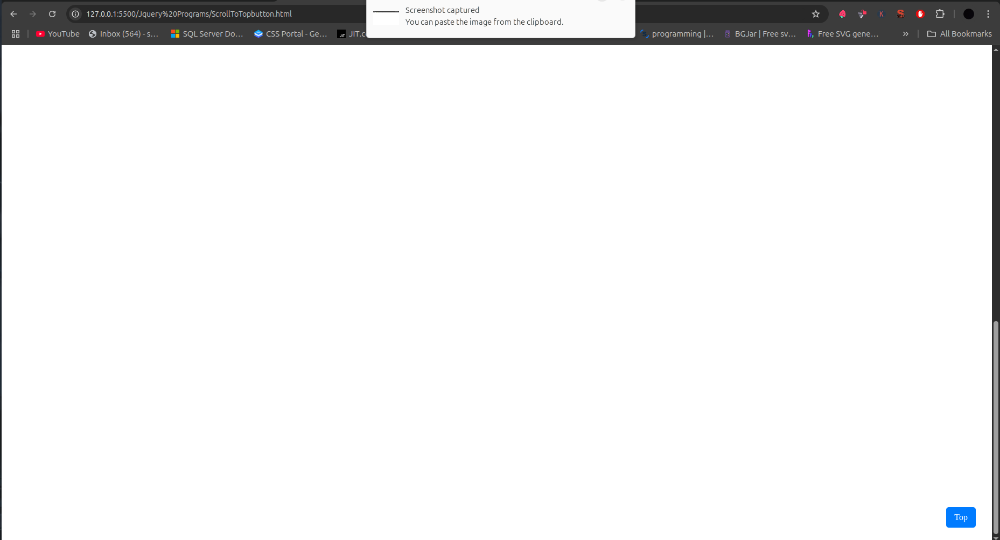

# ⬆️ jQuery Scroll To Top Button





A lightweight "back to top" button that appears when users scroll down the page and smoothly scrolls back to the top when clicked.

## Table of Contents
- [HTML Structure](#html-structure)
- [CSS Styling](#css-styling)
- [jQuery Functionality](#jquery-functionality)
- [How It Works](#how-it-works)
- [Customization](#customization)
- [Browser Support](#browser-support)
- [Complete Code](#complete-code)

## HTML Structure

```html
<div id="topBtn">Top</div>
```

- Single button element with ID `topBtn`
- Positioned absolutely in the bottom-right corner
- Initially hidden (appears after scrolling)

## CSS Styling

```css
#topBtn {
  position: fixed;       /* Stays in viewport */
  bottom: 30px;          /* Position from bottom */
  right: 30px;           /* Position from right */
  display: none;         /* Hidden by default */
  background: #007BFF;   /* Blue background */
  color: white;          /* White text */
  padding: 10px 15px;    /* Comfortable click area */
  cursor: pointer;       /* Hand cursor on hover */
  border-radius: 5px;    /* Rounded corners */
  z-index: 99;           /* Stays above content */
  transition: all 0.3s;  /* Smooth hover effects */
}

#topBtn:hover {
  background: #0056b3;   /* Darker blue on hover */
  transform: scale(1.05); /* Slight grow effect */
}
```

## jQuery Functionality

```javascript
// Show/hide button based on scroll position
$(window).scroll(function () {
  if ($(this).scrollTop() > 100) {
    $('#topBtn').fadeIn();
  } else {
    $('#topBtn').fadeOut();
  }
});

// Smooth scroll to top when clicked
$('#topBtn').click(function () {
  $('html, body').animate({ scrollTop: 0 }, 500);
});
```

### Script Breakdown

1. **Scroll Event Handler**:
   ```javascript
   $(window).scroll(function () { ... });
   ```
   - Listens for page scrolling
   - Checks current scroll position

2. **Visibility Toggle**:
   ```javascript
   if ($(this).scrollTop() > 100) { ... }
   ```
   - Shows button after 100px scroll
   - Hides when near top

3. **Click Handler**:
   ```javascript
   $('html, body').animate({ scrollTop: 0 }, 500);
   ```
   - Animates scroll to top
   - 500ms duration for smooth effect

## How It Works

1. **User Flow**:
   ```mermaid
   sequenceDiagram
     User->>Page: Scrolls down
     Page->>jQuery: Triggers scroll event
     jQuery->>Button: Fades in after 100px
     User->>Button: Clicks
     jQuery->>Page: Animates to top
     Page->>Button: Fades out
   ```

2. **Key Features**:
   - Appears/disappears smoothly
   - Non-intrusive positioning
   - Smooth scrolling animation
   - Lightweight implementation

## Customization

### Change Scroll Threshold
```javascript
if ($(this).scrollTop() > 300) { // Show after 300px
```

### Adjust Scroll Speed
```javascript
.animate({ scrollTop: 0 }, 800); // Slower 800ms animation
```

### Add Fancy Icon
```html
<div id="topBtn">↑</div>
```

```css
#topBtn {
  font-size: 20px;
  width: 40px;
  height: 40px;
  text-align: center;
  line-height: 40px;
}
```

### Different Scroll Target
```javascript
$('#someElement').animate({ scrollTop: 0 }, 500);
```

## Browser Support
| Browser | Version |
|---------|---------|
| Chrome  | All     |
| Firefox | All     |
| Safari  | 5.1+    |
| Edge    | All     |
| IE      | 9+      |

## Complete Code

```html
<!DOCTYPE html>
<html lang="en">
<head>
  <meta charset="UTF-8">
  <title>Scroll To Top</title>
  <script src="https://code.jquery.com/jquery-3.6.0.min.js"></script>
  <style>
    body {
      font-family: 'Segoe UI', Tahoma, Geneva, Verdana, sans-serif;
      line-height: 1.6;
      padding: 20px;
    }
    
    #topBtn {
      position: fixed;
      bottom: 30px;
      right: 30px;
      display: none;
      background: #007BFF;
      color: white;
      padding: 10px 15px;
      cursor: pointer;
      border-radius: 5px;
      border: none;
      outline: none;
      z-index: 99;
      transition: all 0.3s;
    }
    
    #topBtn:hover {
      background: #0056b3;
      transform: scale(1.05);
    }
  </style>
</head>
<body>

  <h1>⬆️ Scroll To Top Button Demo</h1>
  <p style="height: 2000px;">Scroll down to see the button appear...</p>
  
  <button id="topBtn" title="Go to top">Top</button>

  <script>
    $(document).ready(function() {
      // Show/hide button
      $(window).scroll(function() {
        if ($(this).scrollTop() > 100) {
          $('#topBtn').fadeIn();
        } else {
          $('#topBtn').fadeOut();
        }
      });
      
      // Smooth scroll to top
      $('#topBtn').click(function() {
        $('html, body').animate({ scrollTop: 0 }, 500);
        return false;
      });
    });
  </script>
</body>
</html>
```

## Dependencies
- [jQuery](https://jquery.com/) 3.6.0+
