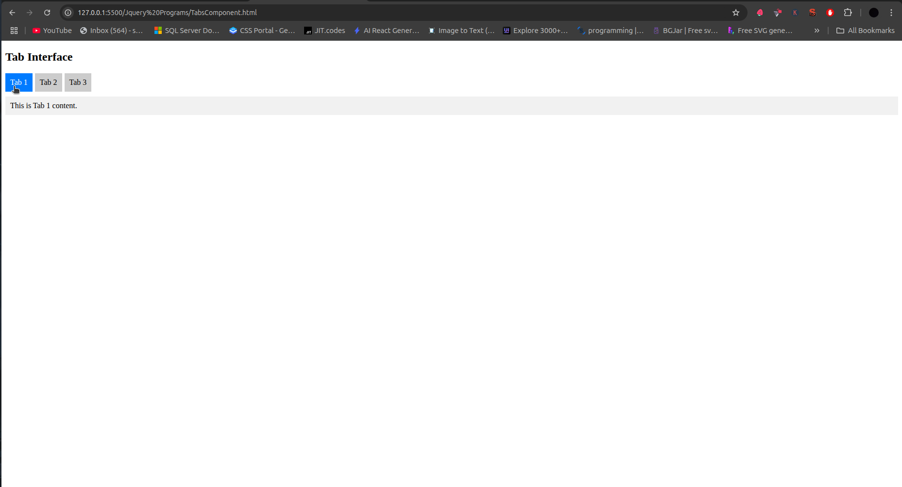
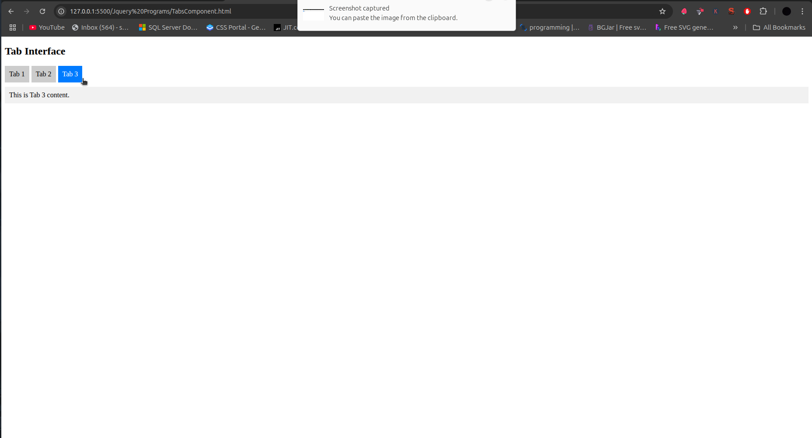

# 🗂 jQuery Tab Interface




A lightweight tabbed interface that switches between content sections without page reloads.

## Table of Contents
- [HTML Structure](#html-structure)
- [CSS Styling](#css-styling)
- [jQuery Functionality](#jquery-functionality)
- [How It Works](#how-it-works)
- [Customization](#customization)
- [Browser Support](#browser-support)
- [Complete Code](#complete-code)

## HTML Structure

```html
<div class="tabs">
  <div class="tab active" data-target="#tab1">Tab 1</div>
  <div class="tab" data-target="#tab2">Tab 2</div>
  <div class="tab" data-target="#tab3">Tab 3</div>
</div>

<div class="content">
  <div id="tab1">Content 1</div>
  <div id="tab2">Content 2</div>
  <div id="tab3">Content 3</div>
</div>
```

- **Tab Navigation**:
  - Container with class `tabs`
  - Individual tab buttons with:
    - `tab` class
    - `data-target` attribute linking to content
    - `active` class for current tab

- **Content Panels**:
  - Container with class `content`
  - Divs with IDs matching tab targets
  - Initially hidden (except first)

## CSS Styling

```css
.tabs {
  display: flex;          /* Horizontal layout */
  cursor: pointer;        /* Indicates clickable */
}

.tabs div {
  padding: 10px;          /* Clickable area */
  background: #ccc;       /* Inactive tab color */
  margin-right: 5px;      /* Spacing between tabs */
}

.tabs .active {
  background: #007BFF;    /* Active tab color */
  color: white;           /* Text contrast */
}

.content div {
  display: none;          /* Hidden by default */
  margin-top: 10px;       /* Space from tabs */
  padding: 10px;          /* Content padding */
  background: #f1f1f1;    /* Content background */
}
```

## jQuery Functionality

```javascript
// Show first tab content on load
$('.content div').first().show();

// Tab click handler
$('.tab').click(function () {
  // Update active tab
  $('.tab').removeClass('active');
  $(this).addClass('active');
  
  // Show corresponding content
  $('.content div').hide();
  $($(this).data('target')).show();
});
```

### Script Breakdown

1. **Initialization**:
   ```javascript
   $('.content div').first().show();
   ```
   - Shows first tab's content on page load

2. **Click Handler**:
   ```javascript
   $('.tab').click(function () { ... })
   ```
   - Executes when any tab is clicked

3. **Tab Activation**:
   ```javascript
   $('.tab').removeClass('active');
   $(this).addClass('active');
   ```
   - Updates visual active state

4. **Content Switching**:
   ```javascript
   $('.content div').hide();
   $($(this).data('target')).show();
   ```
   - Hides all content
   - Shows only targeted content

## How It Works

1. **User Flow**:
   ```mermaid
   sequenceDiagram
     User->>Tab: Clicks
     Tab->>jQuery: Triggers handler
     jQuery->>Tabs: Updates active state
     jQuery->>Content: Hides all
     jQuery->>Target Content: Shows matching
   ```

2. **Key Features**:
   - Instant content switching
   - No page reloads
   - Accessible via keyboard (with enhancements)
   - Minimal DOM manipulation

3. **Data Flow**:
   - `data-target` attributes connect tabs to content
   - jQuery uses these to find correct content

## Customization

### Add Smooth Transitions
```css
.content div {
  transition: opacity 0.3s ease;
  opacity: 0;
  height: 0;
  overflow: hidden;
}

.content div.active {
  opacity: 1;
  height: auto;
}
```

### Vertical Tabs
```css
.tabs {
  flex-direction: column;
  width: 150px;
}
```

### Dynamic Tab Loading
```javascript
$('.tab').click(function() {
  const target = $(this).data('target');
  $(target).load(`content/${target.slice(1)}.html`);
});
```

## Browser Support
| Browser | Version |
|---------|---------|
| Chrome  | All     |
| Firefox | All     |
| Safari  | 5.1+    |
| Edge    | All     |
| IE      | 9+      |

## Complete Code

```html
<!DOCTYPE html>
<html lang="en">
<head>
  <meta charset="UTF-8">
  <title>jQuery Tabs</title>
  <script src="https://code.jquery.com/jquery-3.6.0.min.js"></script>
  <style>
    body {
      font-family: 'Segoe UI', Tahoma, Geneva, Verdana, sans-serif;
      padding: 20px;
      max-width: 800px;
      margin: 0 auto;
    }
    
    .tabs {
      display: flex;
      cursor: pointer;
      border-bottom: 1px solid #ddd;
    }
    
    .tabs .tab {
      padding: 12px 20px;
      background: #f8f9fa;
      margin-right: 5px;
      border: 1px solid #ddd;
      border-bottom: none;
      border-radius: 4px 4px 0 0;
      transition: all 0.2s;
    }
    
    .tabs .tab:hover {
      background: #e9ecef;
    }
    
    .tabs .tab.active {
      background: #007BFF;
      color: white;
      border-color: #007BFF;
    }
    
    .content div {
      display: none;
      padding: 20px;
      border: 1px solid #ddd;
      border-top: none;
      background: white;
    }
  </style>
</head>
<body>

  <h2>Tab Interface</h2>
  
  <div class="tabs">
    <div class="tab active" data-target="#tab1">General</div>
    <div class="tab" data-target="#tab2">Settings</div>
    <div class="tab" data-target="#tab3">Advanced</div>
  </div>
  
  <div class="content">
    <div id="tab1">
      <h3>General Information</h3>
      <p>This is the default tab content.</p>
    </div>
    <div id="tab2">
      <h3>Settings Panel</h3>
      <p>Configure your preferences here.</p>
    </div>
    <div id="tab3">
      <h3>Advanced Options</h3>
      <p>For power users only.</p>
    </div>
  </div>

  <script>
    $(document).ready(function() {
      // Show first tab content
      $('.content div').first().show();
      
      // Tab click handler
      $('.tab').click(function() {
        // Update active tab
        $('.tab').removeClass('active');
        $(this).addClass('active');
        
        // Show corresponding content
        $('.content div').hide();
        $($(this).data('target')).show();
      });
      
      // Keyboard navigation
      $(document).keydown(function(e) {
        const tabs = $('.tab');
        const current = tabs.filter('.active');
        
        if (e.key === 'ArrowRight') {
          const next = current.next('.tab');
          if (next.length) next.click();
        }
        
        if (e.key === 'ArrowLeft') {
          const prev = current.prev('.tab');
          if (prev.length) prev.click();
        }
      });
    });
  </script>
</body>
</html>
```

## Dependencies
- [jQuery](https://jquery.com/) 3.6.0+
