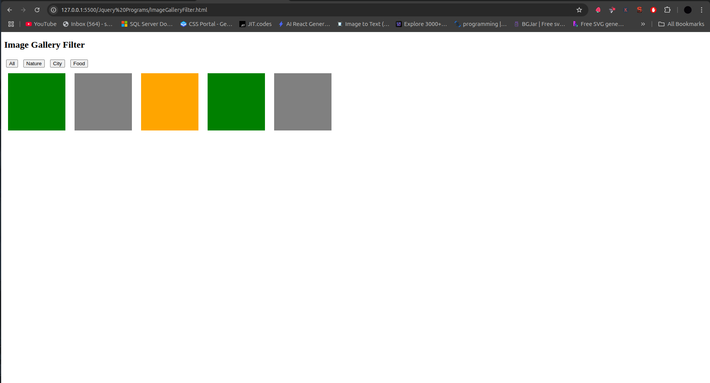

# 🖼️ jQuery Gallery Filter




A lightweight image gallery with category filtering functionality using jQuery.

## Table of Contents
- [HTML Structure](#html-structure)
- [CSS Styling](#css-styling)
- [jQuery Filter Script](#jquery-filter-script)
- [How It Works](#how-it-works)
- [Filtering Logic](#filtering-logic)
- [Customization](#customization)
- [Browser Support](#browser-support)
- [Complete Code](#complete-code)

## HTML Structure

```html
<div class="filter-btns">
  <button data-filter="all">All</button>
  <button data-filter="nature">Nature</button>
  <button data-filter="city">City</button>
  <button data-filter="food">Food</button>
</div>

<div class="gallery">
  <div class="box nature"></div>
  <div class="box city"></div>
  <div class="box food"></div>
  <div class="box nature"></div>
  <div class="box city"></div>
</div>
```

- **Filter Buttons**:
  - Each button has a `data-filter` attribute
  - "All" button shows all items
  - Category buttons filter by specific class

- **Gallery Items**:
  - Each item has:
    - Base `box` class
    - Category class (nature, city, food)
  - Represented as colored divs (replace with images in production)

## CSS Styling

```css
.filter-btns button {
  margin: 5px; /* Button spacing */
}

.box {
  width: 150px;
  height: 150px;
  margin: 10px;
  display: inline-block;
}

/* Category colors */
.nature { background: green; }
.city { background: gray; }
.food { background: orange; }
```

## jQuery Filter Script

```javascript
$('.filter-btns button').click(function () {
  const filter = $(this).data('filter');
  
  if (filter === 'all') {
    $('.box').show();
  } else {
    $('.box').hide();
    $('.' + filter).show();
  }
});
```

### Script Breakdown

1. **Button Selection**:
   ```javascript
   $('.filter-btns button')
   ```
   - Selects all filter buttons

2. **Click Event Handler**:
   ```javascript
   .click(function () { ... })
   ```
   - Executes when any filter button is clicked

3. **Filter Value Extraction**:
   ```javascript
   const filter = $(this).data('filter');
   ```
   - Gets the filter category from button's data attribute

4. **Filtering Logic**:
   - Shows all items for "all" filter
   - Shows only matching items for category filters

## How It Works

1. **User Flow**:
   ```mermaid
   sequenceDiagram
     User->>Filter Button: Clicks
     Button->>jQuery: Gets filter category
     jQuery->>Gallery: Hides all items
     jQuery->>Matching Items: Shows filtered items
   ```

2. **Filtering Process**:
   - Uses jQuery's `show()` and `hide()` methods
   - Matches items by class name
   - Instant visual feedback

3. **Performance**:
   - Minimal DOM manipulation
   - Efficient class-based selection

## Filtering Logic

### Current Filter Rules
1. **"All" Filter**:
   - Shows all gallery items
   - Uses `$('.box').show()`

2. **Category Filters**:
   - Hides all items first
   - Shows only items with matching class
   - Uses `$('.' + filter).show()`

### Enhanced Filtering Example
```javascript
// Add active state to buttons
$('.filter-btns button').removeClass('active');
$(this).addClass('active');

// Smooth transition
$('.box').hide().filter('.' + filter).fadeIn(300);
```

## Customization

### Add Images to Gallery
```html
<div class="box nature">
  
</div>
```

### Multiple Category Filters
```html
<div class="box nature popular"></div>
```

```javascript
// Filter by multiple classes
$('.box').hide().filter('.' + filter1 + '.' + filter2).show();
```

### Active Button Styling
```css
.filter-btns button.active {
  background: #007bff;
  color: white;
}
```

## Browser Support
| Browser | Version |
|---------|---------|
| Chrome  | All     |
| Firefox | All     |
| Safari  | 5.1+    |
| Edge    | All     |
| IE      | 9+      |

## Complete Code

```html
<!DOCTYPE html>
<html lang="en">
<head>
  <meta charset="UTF-8">
  <title>jQuery Gallery Filter</title>
  <script src="https://code.jquery.com/jquery-3.6.0.min.js"></script>
  <style>
    body {
      font-family: sans-serif;
      padding: 20px;
    }
    .filter-btns button {
      margin: 5px;
      padding: 8px 16px;
      cursor: pointer;
    }
    .gallery {
      margin-top: 20px;
    }
    .box {
      width: 150px;
      height: 150px;
      margin: 10px;
      display: inline-block;
      transition: all 0.3s ease;
    }
    .nature { background: green; }
    .city { background: gray; }
    .food { background: orange; }
  </style>
</head>
<body>
  <h2>Image Gallery Filter</h2>
  
  <div class="filter-btns">
    <button data-filter="all" class="active">All</button>
    <button data-filter="nature">Nature</button>
    <button data-filter="city">City</button>
    <button data-filter="food">Food</button>
  </div>

  <div class="gallery">
    <div class="box nature"></div>
    <div class="box city"></div>
    <div class="box food"></div>
    <div class="box nature"></div>
    <div class="box city"></div>
  </div>

  <script>
    $('.filter-btns button').click(function () {
      const filter = $(this).data('filter');
      
      // Update active button
      $('.filter-btns button').removeClass('active');
      $(this).addClass('active');
      
      // Filter items
      if (filter === 'all') {
        $('.box').fadeIn(300);
      } else {
        $('.box').hide();
        $('.' + filter).fadeIn(300);
      }
    });
  </script>
</body>
</html>
```

## Dependencies
- [jQuery](https://jquery.com/) 3.6.0+