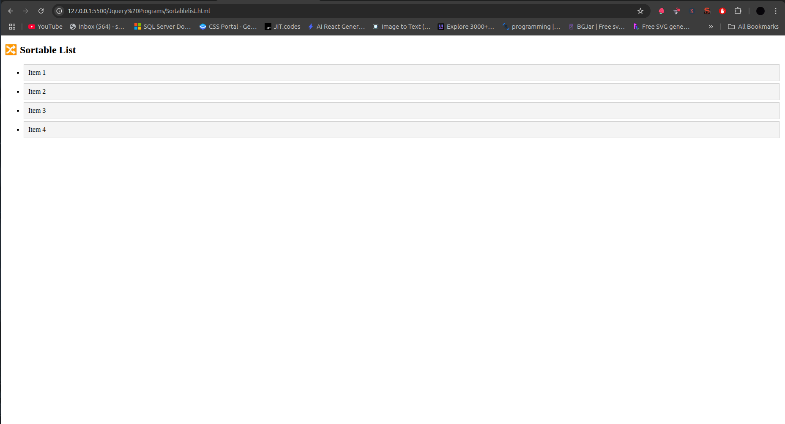
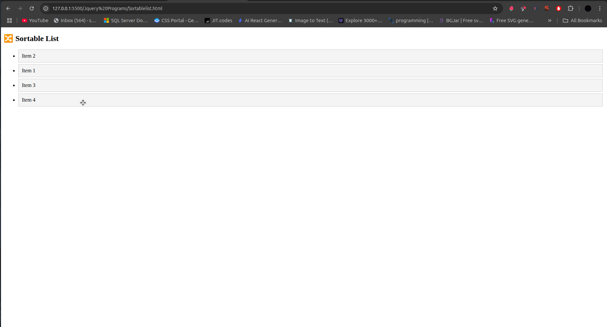

# 🔀 jQuery UI Sortable List




A drag-and-drop sortable list implementation using jQuery UI that allows users to reorder items visually.

## Table of Contents
- [HTML Structure](#html-structure)
- [CSS Styling](#css-styling)
- [jQuery UI Initialization](#jquery-ui-initialization)
- [How It Works](#how-it-works)
- [Customization](#customization)
- [Browser Support](#browser-support)
- [Complete Code](#complete-code)

## HTML Structure

```html
<ul id="sortable">
  <li>Item 1</li>
  <li>Item 2</li>
  <li>Item 3</li>
  <li>Item 4</li>
</ul>
```

- **Sortable Container**:
  - `<ul>` element with ID `sortable`
  - Contains list items to be sorted

- **List Items**:
  - Regular `<li>` elements
  - Can contain any HTML content
  - Automatically become draggable

## CSS Styling

```css
#sortable li {
  padding: 10px;          /* Item padding */
  margin: 5px;            /* Spacing between items */
  background: #f4f4f4;    /* Light gray background */
  cursor: move;           /* Move cursor on hover */
  border: 1px solid #ccc; /* Border for visibility */
  list-style-type: none;  /* Remove default bullets */
}
```

## jQuery UI Initialization

```javascript
$(function () {
  $('#sortable').sortable();
});
```

### Script Breakdown

1. **Document Ready**:
   ```javascript
   $(function () { ... });
   ```
   - Ensures DOM is fully loaded before initialization

2. **Sortable Initialization**:
   ```javascript
   $('#sortable').sortable();
   ```
   - Converts selected element into sortable list
   - All direct children become draggable

3. **Default Behavior**:
   - Items can be dragged vertically
   - Visual placeholder during drag
   - Smooth reordering animation

## How It Works

1. **User Interaction**:
   ```mermaid
   sequenceDiagram
     User->>ListItem: Drags item
     ListItem->>jQueryUI: Starts sort
     jQueryUI->>List: Calculates position
     List->>List: Reorders items
     jQueryUI->>List: Animates drop
   ```

2. **Key Features**:
   - Native drag-and-drop functionality
   - Visual feedback during sorting
   - Accessibility support
   - Touch device compatibility

3. **Behind the Scenes**:
   - Maintains original DOM order
   - Updates position values during sort
   - Handles mouse/touch events

## Customization

### Change Drag Handle
```html
<li><span class="handle">☰</span> Item 1</li>
```

```javascript
$('#sortable').sortable({
  handle: '.handle'
});
```

### Connect Multiple Lists
```html
<ul id="sortable1" class="connected">
<ul id="sortable2" class="connected">
```

```javascript
$('.connected').sortable({
  connectWith: '.connected'
});
```

### Add Placeholder Styling
```css
#sortable li.ui-sortable-placeholder {
  background: #ffeeba;
  visibility: visible !important;
}
```

### Get Current Order
```javascript
$('#sortable').sortable('toArray');
```

## Browser Support
| Browser | Version |
|---------|---------|
| Chrome  | All     |
| Firefox | All     |
| Safari  | 6.1+    |
| Edge    | All     |
| IE      | 9+      |

## Complete Code

```html
<!DOCTYPE html>
<html lang="en">
<head>
  <meta charset="UTF-8">
  <title>Sortable List</title>
  <!-- jQuery UI CSS -->
  <link rel="stylesheet" href="https://code.jquery.com/ui/1.13.2/themes/base/jquery-ui.css" />
  <!-- jQuery + jQuery UI -->
  <script src="https://code.jquery.com/jquery-3.6.0.min.js"></script>
  <script src="https://code.jquery.com/ui/1.13.2/jquery-ui.min.js"></script>
  <style>
    body {
      font-family: 'Segoe UI', Tahoma, Geneva, Verdana, sans-serif;
      padding: 20px;
    }
    
    #sortable {
      padding: 0;
      width: 300px;
    }
    
    #sortable li {
      padding: 10px;
      margin: 5px 0;
      background: #f8f9fa;
      cursor: move;
      border: 1px solid #dee2e6;
      border-radius: 4px;
      list-style-type: none;
      transition: all 0.2s;
    }
    
    #sortable li:hover {
      background: #e9ecef;
    }
    
    #sortable li.ui-sortable-helper {
      box-shadow: 0 4px 8px rgba(0,0,0,0.1);
    }
  </style>
</head>
<body>

  <h2>🔀 Sortable List</h2>
  <ul id="sortable">
    <li>Item 1</li>
    <li>Item 2</li>
    <li>Item 3</li>
    <li>Item 4</li>
  </ul>

  <script>
    $(function() {
      $('#sortable').sortable({
        placeholder: "ui-state-highlight",
        opacity: 0.6,
        update: function(event, ui) {
          console.log('New order:', $(this).sortable('toArray'));
        }
      });
      $('#sortable').disableSelection();
    });
  </script>

</body>
</html>
```

## Dependencies
- [jQuery](https://jquery.com/) 3.6.0+
- [jQuery UI](https://jqueryui.com/) 1.13.2+
