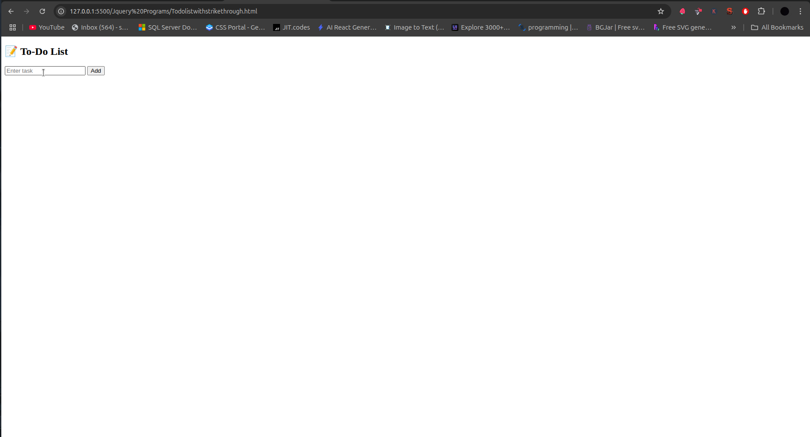
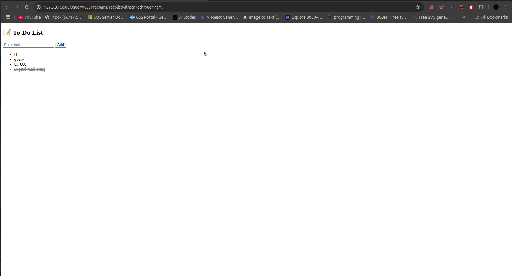

# 📝 jQuery To-Do List





A simple interactive to-do list application that allows adding and marking tasks as complete.

## Table of Contents
- [HTML Structure](#html-structure)
- [CSS Styling](#css-styling)
- [jQuery Functionality](#jquery-functionality)
- [How It Works](#how-it-works)
- [Customization](#customization)
- [Browser Support](#browser-support)
- [Complete Code](#complete-code)

## HTML Structure

```html
<input type="text" id="task" placeholder="Enter task" />
<button id="addBtn">Add</button>
<ul id="todoList"></ul>
```

- **Input Field**:
  - Text input for new tasks (`#task`)
  - Placeholder text for user guidance

- **Add Button**:
  - Triggers new task creation
  - ID `addBtn` for jQuery selection

- **Task List**:
  - Empty unordered list (`#todoList`)
  - Dynamically populated with tasks

## CSS Styling

```css
li {
  cursor: pointer;        /* Indicates clickable items */
  margin: 5px 0;          /* Spacing between items */
  padding: 8px;           /* Comfortable click area */
  list-style-type: none;  /* Remove default bullets */
  transition: all 0.3s;   /* Smooth state changes */
}

.done {
  text-decoration: line-through; /* Strike-through effect */
  color: gray;                   /* Muted appearance */
  opacity: 0.7;                  /* Semi-transparent */
}

#task {
  padding: 8px;
  margin-right: 5px;
}

#addBtn {
  padding: 8px 16px;
  cursor: pointer;
}
```

## jQuery Functionality

```javascript
// Add new task
$('#addBtn').click(function () {
  const task = $('#task').val().trim();
  if (task !== '') {
    $('#todoList').append(`<li>${task}</li>`);
    $('#task').val('').focus();
  }
});

// Toggle task completion
$('#todoList').on('click', 'li', function () {
  $(this).toggleClass('done');
});
```

### Script Breakdown

1. **Add Task**:
   ```javascript
   $('#addBtn').click(function () { ... })
   ```
   - Gets input value
   - Validates non-empty input
   - Appends new list item
   - Clears input field

2. **Task Completion**:
   ```javascript
   $('#todoList').on('click', 'li', ...)
   ```
   - Uses event delegation
   - Toggles `done` class on click
   - Works for dynamically added items

3. **Event Delegation**:
   - Essential for dynamic content
   - More efficient than individual handlers
   - Listens at parent level

## How It Works

1. **User Flow**:
   ```mermaid
   sequenceDiagram
     User->>Input: Enters task text
     User->>Add Button: Clicks
     jQuery->>List: Appends new item
     User->>Task: Clicks to toggle
     jQuery->>Task: Toggles visual state
   ```

2. **Key Features**:
   - Simple task addition
   - Visual completion feedback
   - Persistent focus for rapid entry
   - Clean, intuitive interface

3. **Data Flow**:
   - Tasks exist only in DOM
   - No server-side persistence
   - State maintained via CSS classes

## Customization

### Add Task on Enter Key
```javascript
$('#task').keypress(function (e) {
  if (e.which === 13) { // Enter key
    $('#addBtn').click();
  }
});
```

### Add Delete Functionality
```javascript
$('#todoList').on('click', '.delete', function(e) {
  e.stopPropagation();
  $(this).parent().remove();
});

// Modify append to include delete button
$('#todoList').append(
  `<li>${task} <span class="delete">×</span></li>`
);
```

### Add Local Storage
```javascript
// Save
localStorage.setItem('todos', $('#todoList').html());

// Load
if (localStorage.getItem('todos')) {
  $('#todoList').html(localStorage.getItem('todos'));
}
```

## Browser Support
| Browser | Version |
|---------|---------|
| Chrome  | All     |
| Firefox | All     |
| Safari  | 5.1+    |
| Edge    | All     |
| IE      | 9+      |

## Complete Code

```html
<!DOCTYPE html>
<html lang="en">
<head>
  <meta charset="UTF-8">
  <title>jQuery To-Do</title>
  <script src="https://code.jquery.com/jquery-3.6.0.min.js"></script>
  <style>
    body {
      font-family: 'Segoe UI', Tahoma, Geneva, Verdana, sans-serif;
      max-width: 500px;
      margin: 0 auto;
      padding: 20px;
    }
    
    #task {
      padding: 10px;
      width: 70%;
      border: 1px solid #ddd;
      border-radius: 4px;
    }
    
    #addBtn {
      padding: 10px 15px;
      background: #007BFF;
      color: white;
      border: none;
      border-radius: 4px;
      cursor: pointer;
    }
    
    #addBtn:hover {
      background: #0056b3;
    }
    
    #todoList {
      padding: 0;
      margin-top: 20px;
    }
    
    #todoList li {
      padding: 10px;
      background: #f8f9fa;
      margin-bottom: 5px;
      border-radius: 4px;
      cursor: pointer;
      display: flex;
      justify-content: space-between;
      align-items: center;
    }
    
    #todoList li:hover {
      background: #e9ecef;
    }
    
    .done {
      text-decoration: line-through;
      color: #6c757d;
      background: #f1f1f1 !important;
    }
    
    .delete {
      color: #dc3545;
      font-weight: bold;
      padding: 0 5px;
    }
  </style>
</head>
<body>

  <h2>📝 To-Do List</h2>
  <div>
    <input type="text" id="task" placeholder="Enter task" />
    <button id="addBtn">Add</button>
  </div>
  <ul id="todoList"></ul>

  <script>
    $(document).ready(function() {
      // Load saved tasks
      if (localStorage.getItem('todos')) {
        $('#todoList').html(localStorage.getItem('todos'));
      }
      
      // Add new task
      $('#addBtn').click(function() {
        const task = $('#task').val().trim();
        if (task !== '') {
          $('#todoList').append(`
            <li>
              ${task}
              <span class="delete">×</span>
            </li>
          `);
          $('#task').val('').focus();
          saveTasks();
        }
      });
      
      // Add on Enter key
      $('#task').keypress(function(e) {
        if (e.which === 13) {
          $('#addBtn').click();
        }
      });
      
      // Toggle completion
      $('#todoList').on('click', 'li', function() {
        $(this).toggleClass('done');
        saveTasks();
      });
      
      // Delete task
      $('#todoList').on('click', '.delete', function(e) {
        e.stopPropagation();
        $(this).parent().remove();
        saveTasks();
      });
      
      // Save to local storage
      function saveTasks() {
        localStorage.setItem('todos', $('#todoList').html());
      }
    });
  </script>
</body>
</html>
```

## Dependencies
- [jQuery](https://jquery.com/) 3.6.0+
